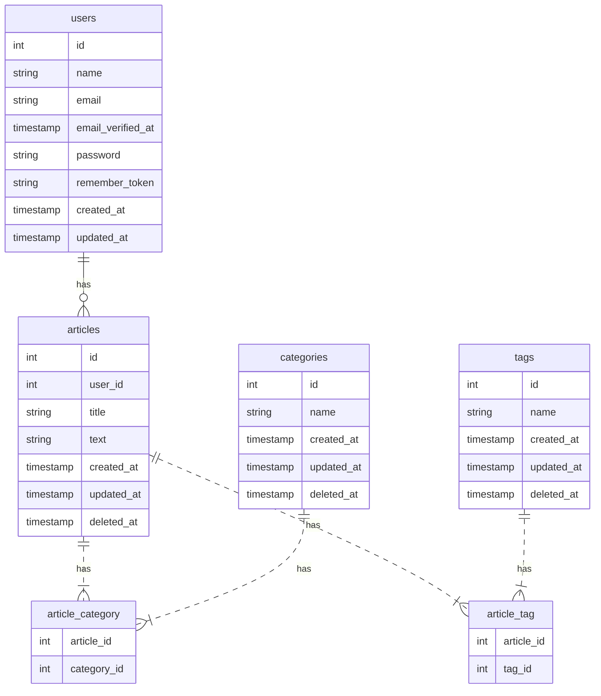

# Laravel Mini Blog

Mini blog exercise project made with Laravel 9.x

# Table of contents

-   [Database Structure](#database-structure)
-   [References](#references)

## Database Structure

## References

This project is from a course by [Laravel Daily](https://www.youtube.com/c/LaravelDaily).
The course is [Laravel Eloquent: Expert Level](https://laraveldaily.teachable.com/courses/enrolled/393790).
The mini-blog project is [the last lesson of the course](https://laraveldaily.teachable.com/courses/393790/lectures/6283958).
